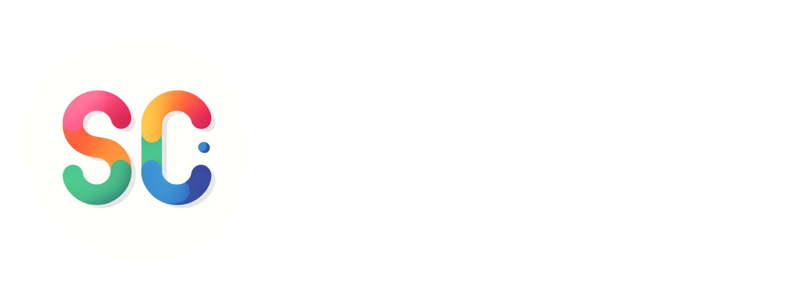

## Hi there 👋🏻

`Pragmatic Software Developer`

Hi, my name is Jan and I'm a full-stack software developer with over 3yr of experience. I like working on small and big codebases, tackling the unknown. My goal is to be a generalist who can bring value regardless of the stage the project is in. Coffee lover -  gives me power to do unachievable things ⚡⚡⚡

## Exp log:

`DEC '23` - `currently` - 

`APR '21` - `DEC '23` - 

`JAN '21` - `FEB '22` - 

## Projects:

## Socials:

 

